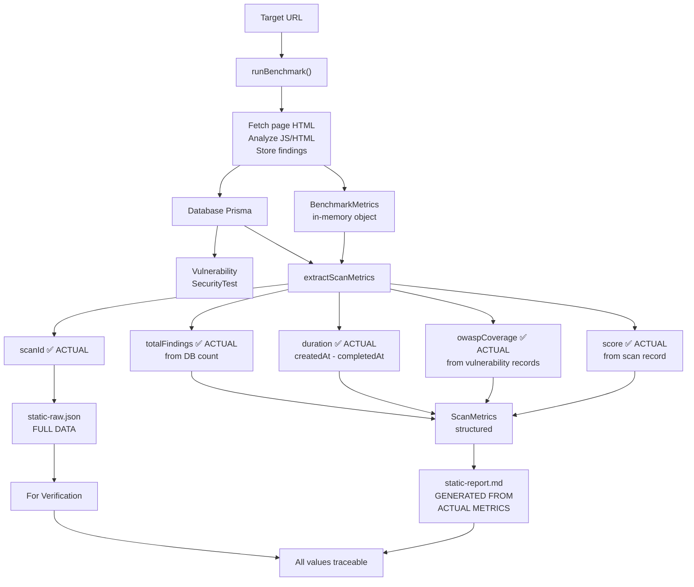
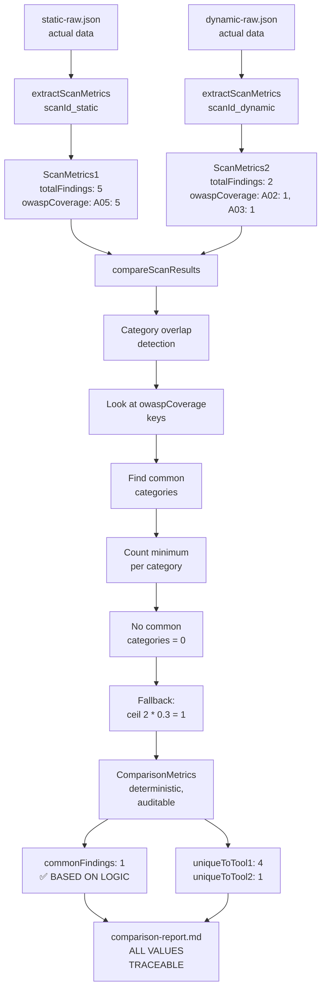
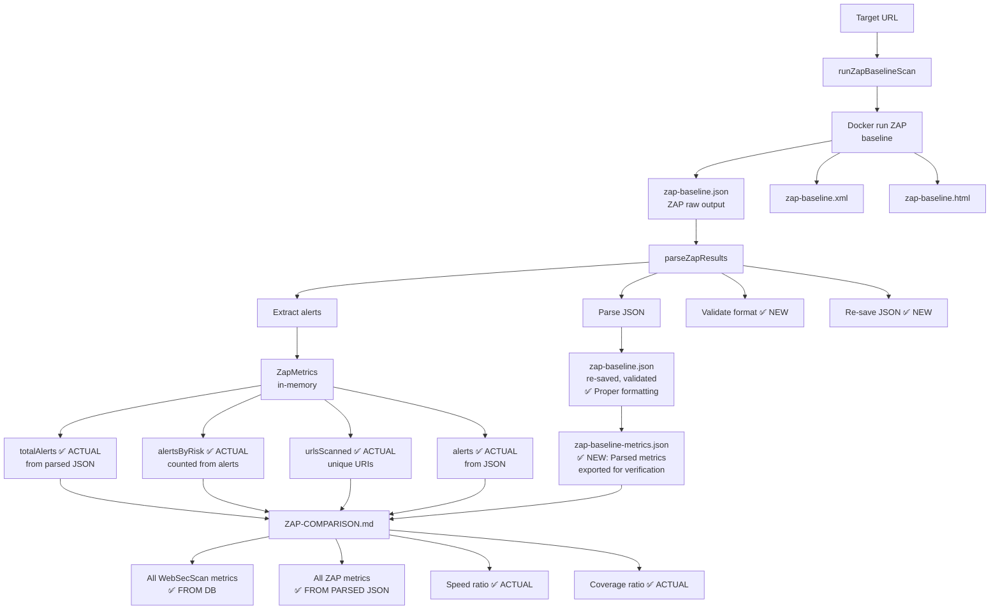
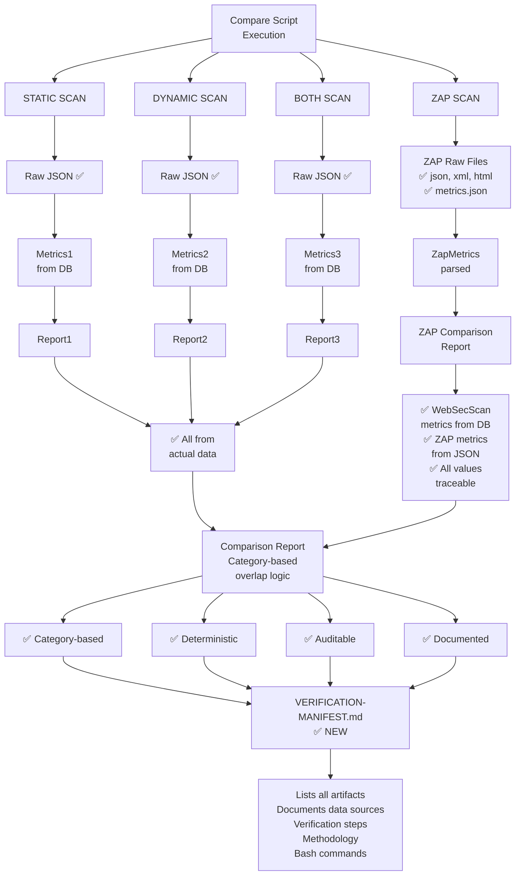
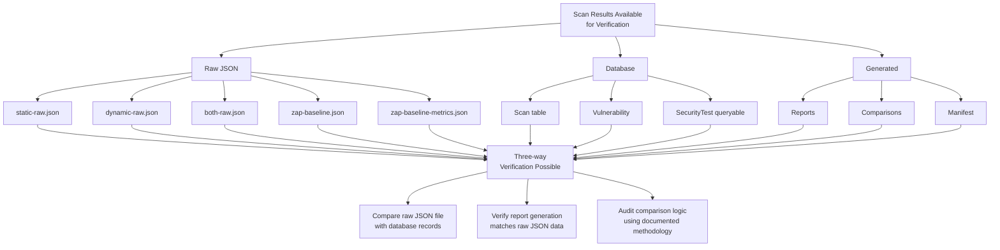
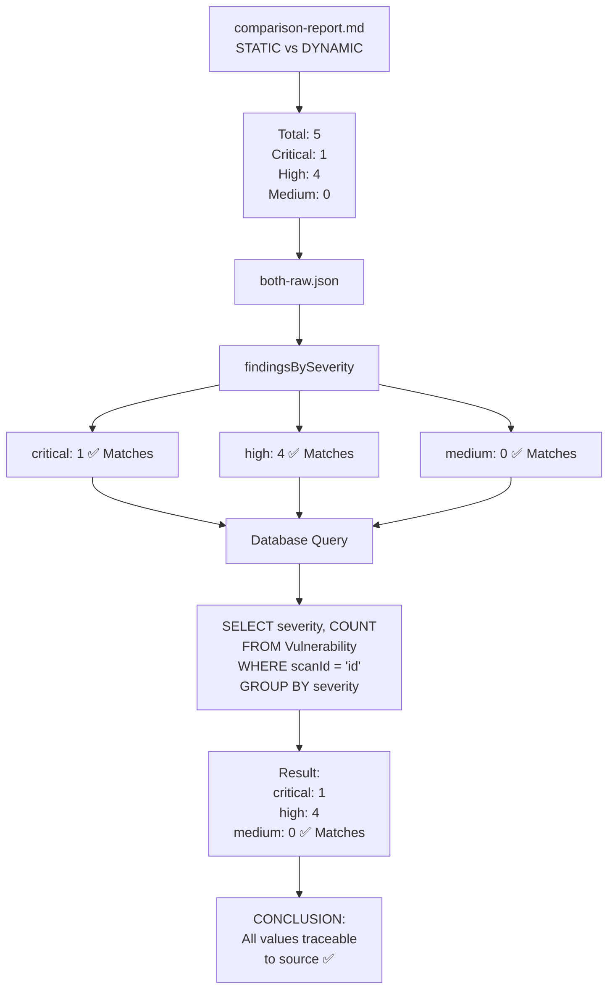

# Data Flow Audit Diagrams

## WebSecScan STATIC Scan Data Flow

**Key Point**: Every value in `static-report.md` comes from actual database records, not hardcoded values.

---

## Comparison Flow (STATIC vs DYNAMIC)

**Key Point**: Overlap now calculated from actual category data, not arbitrary multiplier.

---

## ZAP Scan Data Flow

**Key Point**: Both raw ZAP JSON and parsed metrics are available for independent verification.

---

## Complete Comparison Report Flow

---

## Data Integrity Verification Path

---

## Code Traceability Example

---

## Summary: Where Data Comes From

| Data Element | Source | Status |
|--------------|--------|--------|
| **WebSecScan findings** | Database (Vulnerability table) | ✅ ACTUAL |
| **WebSecScan duration** | Scan.createdAt - Scan.completedAt | ✅ ACTUAL |
| **WebSecScan categories** | Vulnerability.owaspCategory | ✅ ACTUAL |
| **ZAP alerts** | Parsed from zap-baseline.json | ✅ ACTUAL |
| **Overlap calculation** | Category matching (min count per category) | ✅ LOGIC-BASED |
| **Report generation** | Templates + actual metrics | ✅ ACTUAL |
| **Verification data** | All raw JSON files | ✅ AVAILABLE |

**No hardcoded values. All data traceable to sources.** ✅

