# WebSecScan Architecture Specification

This document describes the technical architecture, design principles, and implementation details of **WebSecScan**. It is intended for developers, researchers, and contributors seeking a clear, comprehensive understanding of the system.

---

## 1. System Overview

WebSecScan is a modular, full-stack web security scanner built on Next.js. It separates concerns between the user interface, business logic, and security scanning engines, ensuring maintainability, extensibility, and security.

### 1.1 High-Level Architecture

#### System Layers

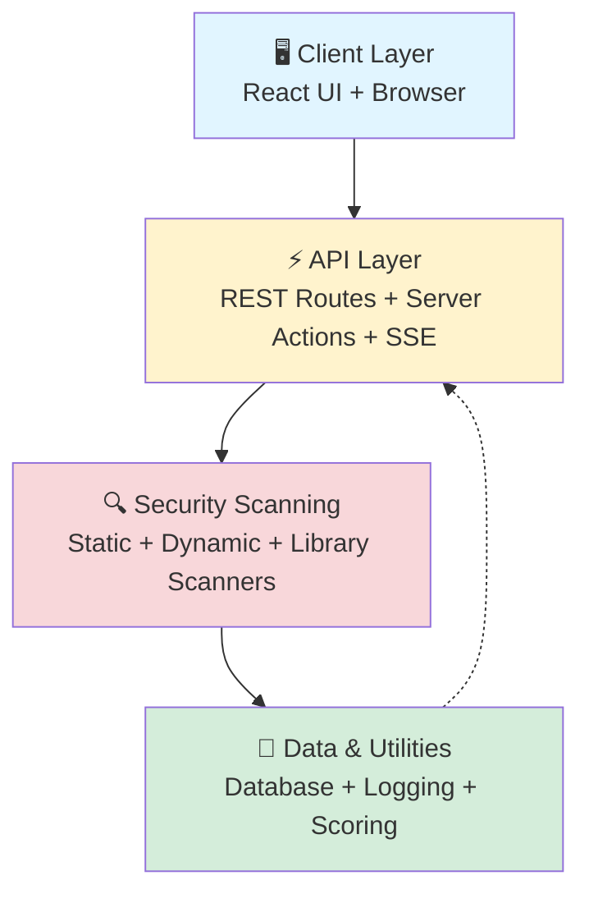

#### Request Flow

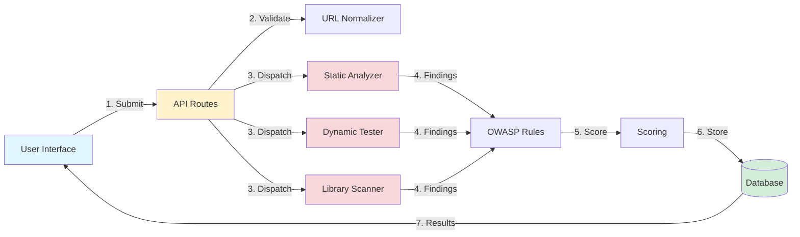

---

## 2. Technology Stack

### 2.1 Core Framework

| Technology     | Version  | Purpose                                         |
|----------------|----------|-------------------------------------------------|
| **Next.js**    | 16.1.0   | Full-stack React framework with App Router      |
| **TypeScript** | 5.x      | Strict type-safe development                    |
| **React**      | 19.2.3   | UI component library                            |
| **Node.js**    | ≥18.x    | Runtime environment                             |

### 2.2 Data Layer

| Technology      | Purpose                                   |
|-----------------|-------------------------------------------|
| **Prisma ORM**  | Type-safe database access and migrations  |
| **SQLite**      | Embedded database for dev/testing         |
| **PostgreSQL**  | Production database option                |

### 2.3 Security & Testing

| Technology      | Purpose                                   |
|-----------------|-------------------------------------------|
| **Playwright**  | Headless browser for dynamic testing      |
| **Cheerio**     | Fast HTML parsing for static analysis     |
| **Node Test Runner** | Built-in test framework              |

### 2.4 UI/UX

| Technology                  | Purpose                                |
|-----------------------------|----------------------------------------|
| **Tailwind CSS**            | Utility-first CSS framework            |
| **Next.js Server Components** | Server-side rendering & streaming    |

---

## 3. Project Structure

```
WebSecScan/
├── src/
│   ├── app/                    # Next.js App Router
│   │   ├── page.tsx           # Dashboard UI
│   │   ├── layout.tsx         # Root layout
│   │   ├── actions.ts         # Server Actions
│   │   ├── api/               # REST API Routes
│   │   │   ├── scan/
│   │   │   │   ├── start/route.ts
│   │   │   │   └── [id]/
│   │   │   │       ├── status/route.ts
│   │   │   │       └── results/route.ts
│   │   │   └── history/
│   │   │       └── [hostname]/route.ts  # Scan history
│   │   ├── scan/[id]/         # Scan details page
│   │   └── results/           # Results page
│   │
│   ├── components/            # React Components
│   │   ├── ScanForm.tsx           # Scan configuration form
│   │   ├── ScanSummaryCard.tsx    # Scan list card
│   │   ├── VulnerabilityCard.tsx  # Vulnerability display
│   │   ├── ScoreCard.tsx          # Security score badge
│   │   ├── SecurityTestCard.tsx   # Individual test result
│   │   ├── ScanHistory.tsx        # Historical scans table
│   │   └── ScanLogs.tsx           # Real-time log display (NEW)
│   │
│   ├── lib/                   # Shared utilities
│   │   ├── db.ts                 # Prisma client singleton
│   │   ├── scoring.ts            # Security scoring system
│   │   ├── urlNormalizer.ts      # URL validation & normalization
│   │   └── scanLogger.ts         # Real-time logging via SSE (NEW)
│   │
│   └── security/              # Security scanning engines
│       ├── static/            # Static analysis
│       │   ├── jsAnalyzer.ts
│       │   ├── htmlAnalyzer.ts
│       │   └── dependencyAnalyzer.ts
│       ├── dynamic/           # Dynamic testing
│       │   ├── crawler.ts
│       │   ├── xssTester.ts
│       │   ├── authChecks.ts
│       │   ├── headerAnalyzer.ts    # HTTP security headers
│       │   ├── cookieAnalyzer.ts    # Cookie security
│       │   └── cspAnalyzer.ts       # CSP analysis
│       └── rules/
│           └── owaspRules.ts  # OWASP mapping & rules
│
├── prisma/
│   ├── schema.prisma          # Database schema
│   ├── migrations/            # Database migrations
│   │   └── 20251220100133_add_scoring_and_tests/
│   │       └── migration.sql
│   └── seed.ts               # Test data seeder
│
├── __tests__/                 # Test suites
│   ├── jsAnalyzer.test.ts
│   ├── htmlAnalyzer.test.ts
│   ├── dependencyAnalyzer.test.ts
│   ├── urlNormalizer.test.ts      # URL normalization tests (NEW)
│   └── integration.test.ts
│
├── test-fixtures/             # Vulnerable test files
│   ├── vulnerable-script.js
│   ├── vulnerable-app.html
│   └── insecure-package.json
│
├── docs/                      # Documentation (MkDocs)
├── .github/                   # CI/CD & GitHub config
│   ├── copilot-instructions.md
│   └── workflows/
│       └── docs.yml          # GitHub Pages deployment
│
├── docker-compose.yml         # Docker orchestration
├── Dockerfile                 # Container image
├── package.json              # Node dependencies
└── tsconfig.json             # TypeScript config
```

---

## 4. Data Flow and Scan Lifecycle

### 4.1 Scan Workflow Phases

#### Phase 1: Initialization

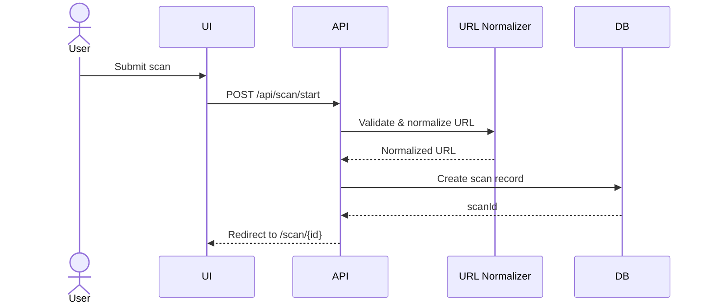

#### Phase 2: Scanning & Analysis

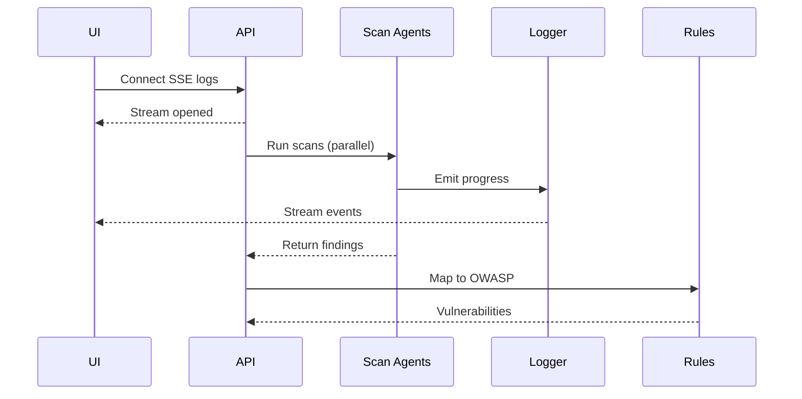

#### Phase 3: Scoring & Storage

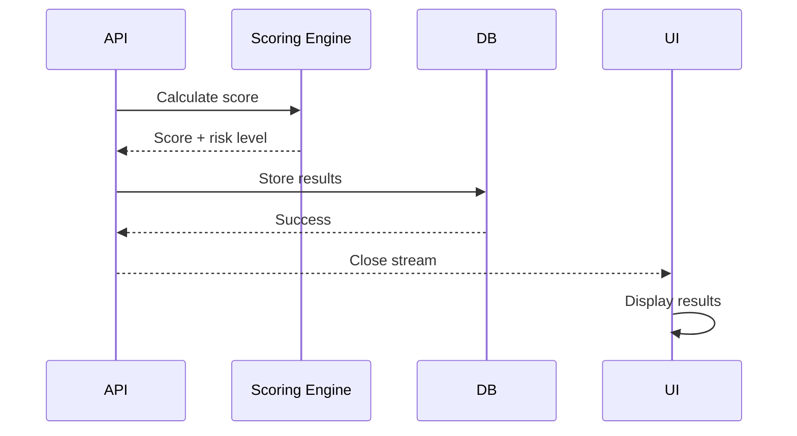

### 4.2 Scan Execution Flow

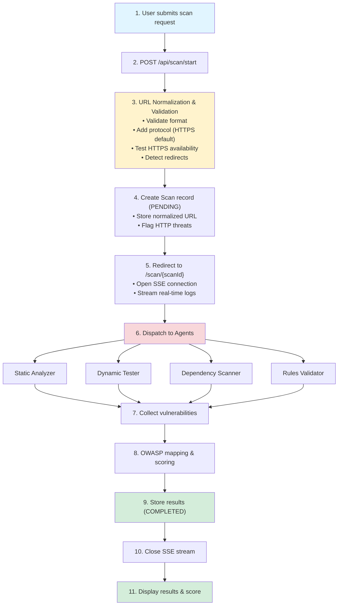

### 4.3 Input Processing Pipeline

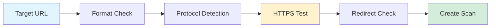

### 4.4 Scan Execution Pipeline

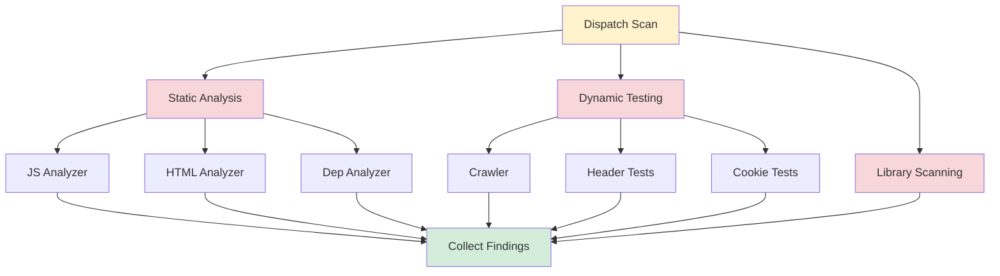

### 4.5 Results Processing Pipeline

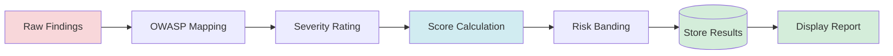

---

## 5. Scanning Agents

WebSecScan uses specialized, modular agents for deterministic security checks. Each agent runs in an isolated environment (process, container, or thread) for safety and resource control.

### 5.1 Static Analysis Agent

- **Purpose:** Rule-based, deterministic analysis of source artifacts (JS/TS, HTML, templates).
- **Components:**
  - `jsAnalyzer`: Detects dangerous APIs (e.g., `eval`, `new Function`), unsanitized sinks, insecure cookie usage, and hardcoded secrets via regex rules.
  - `htmlAnalyzer`: Looks for unsafe `innerHTML` usage, missing/misconfigured CSP meta tags, and insecure form attributes.
  - `dependencyAnalyzer`: Lightweight parsing of manifest files (`package.json`) for static dependency checks.
- **Output:** Structured `Vulnerability` objects with canonical ID, OWASP category, severity, confidence, evidence, and remediation guidance.

#### Static Analysis Engine Architecture

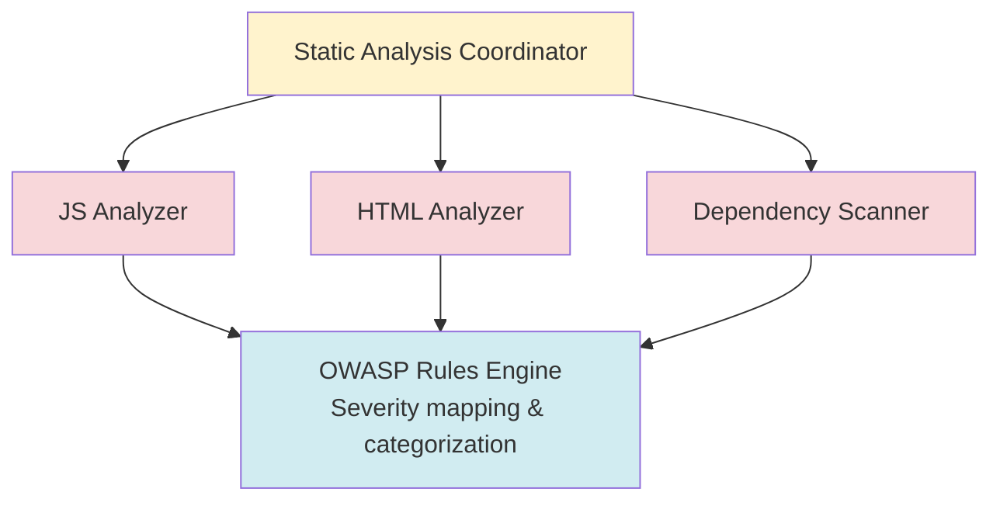

**Example Implementation:**

```typescript
export async function analyzeJavaScript(
  code: string,
  filename: string
): Promise<AnalysisResult> {
  // ...pattern matching, evidence extraction, rule application...
}
```

```typescript
export async function analyzeHTML(
  html: string,
  filename: string
): Promise<AnalysisResult> {
  // ...CSP checks, inline script detection, form security checks...
}
```

### 5.2 Dynamic Analysis Agent

- **Purpose:** Safe, non-destructive runtime tests against a permitted target URL.
- **Components:**
  - `crawler`: Conservative crawler respecting robots.txt and rate limits; discovers endpoints and input points.
  - `xssTester`: Sends safe reflected XSS payloads; captures responses and DOM reflections.
  - `authChecks`: Verifies insecure auth patterns (e.g., weak redirects, missing session flags) without brute forcing.
- **Implementation:** Uses Playwright (headless), enforces timeouts and request throttling.

#### Dynamic Testing Engine Architecture

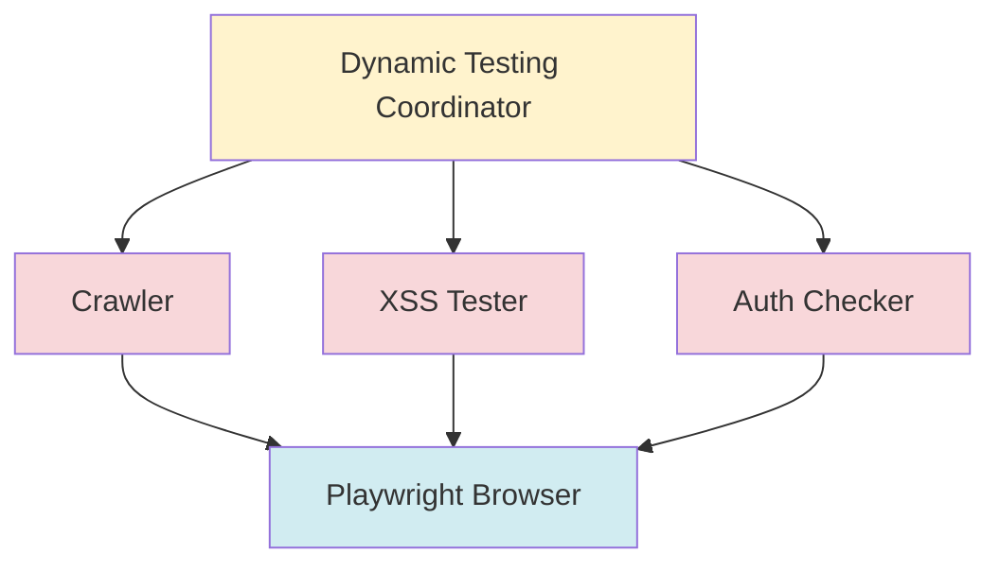

**Example Implementation:**

```typescript
export async function crawl(
  startUrl: string,
  options: CrawlOptions
): Promise<CrawlResult> {
  // ...browser automation, endpoint discovery, rate limiting...
}
```

```typescript
export async function testXSS(
  endpoint: Endpoint,
  options: TestOptions
): Promise<XSSResult[]> {
  // ...payload injection, reflection detection, evidence extraction...
}
```

### 5.3 Library Scanner Agent

- **Purpose:** Identify known vulnerable dependency versions and outdated packages.
- **Behavior:** Parses manifests, checks against curated vulnerability feeds (NVD/CVE, OSS advisories), and produces fix guidance.
- **Safety:** No network scanning or credential usage beyond fetching public advisories.

---

## 6. Agent Configuration & Safety

- **Configuration Options:** Exposed via UI/API: `scanMode` (STATIC/DYNAMIC/BOTH), `maxDepth`, `rateLimit`, `allowExternalRequests`.
- **Safety Constraints:**
  - Dynamic tests are non-destructive: no brute force, DoS, exploit chaining, or account takeover.
  - Scans must only target assets owned or with explicit permission (UI enforces consent).
- **Outputs & Integration:**
  - Agents emit structured results stored via Prisma `Scan`/`Vulnerability` models.
  - Each finding includes canonical ID, OWASP mapping, severity, confidence, evidence, and remediation guidance.
  - Verbose debug output is logged server-side only.

---

## 7. URL Normalization Module

**Location:** `src/lib/urlNormalizer.ts`

**Purpose:** Validates, normalizes, and secures target URLs before scanning.

**Key Functions:**
- `normalizeUrl(inputUrl, options)`: Adds protocol, tests HTTPS, detects redirects, returns comprehensive info.
- `validateUrlFormat(url)`: Checks format, credentials, hostname.
- `testUrlConnection(url, timeout)`: Non-destructive HEAD request.
- `checkRedirects(url, timeout)`: Follows redirects, detects www-redirects.

**Security Features:**
- Automatic HTTPS upgrade.
- HTTP usage flagged as HIGH severity (OWASP A04:2025 - Cryptographic Failures).
- Non-destructive testing, configurable timeouts.

**Integration Example:**

```typescript
const normalizeResult = await normalizeUrl(targetUrl, {
  preferHttps: true,
  checkRedirects: true,
  timeout: 10000,
});
if (normalizeResult.securityThreats.length > 0) {
  await recordProtocolVulnerability(scanId, threat);
}
```

---

## 8. Database Schema

```prisma
model Scan {
  id           String          @id @default(cuid())
  targetUrl    String
  hostname     String
  mode         ScanMode
  status       ScanStatus      @default(PENDING)
  score        Int?            // Security score (0-100)
  grade        String?         // Grade: A+, A, B, C, D, F
  createdAt    DateTime        @default(now())
  completedAt  DateTime?
  scanSummary  Json?           // Raw headers, cookies, CSP
  
  results      Vulnerability[]
  securityTests SecurityTest[]
  
  @@index([status])
  @@index([hostname])
  @@index([grade])
}

model Vulnerability {
  id            String     @id @default(cuid())
  scanId        String
  type          String
  severity      Severity
  confidence    Confidence
  description   String
  location      String
  remediation   String
  owaspCategory String?
  owaspId       String?
  ruleId        String?
  scan          Scan       @relation(fields: [scanId], references: [id])
  
  @@index([scanId])
  @@index([severity])
}

model SecurityTest {
  id             String      @id @default(cuid())
  scanId         String
  testName       String      // e.g., "Content Security Policy"
  passed         Boolean
  score          Int         // Score contribution
  result         String      // "Passed", "Failed", "Info", "N/A"
  reason         String?
  recommendation String?
  details        Json?       // Structured test data
  scan           Scan        @relation(fields: [scanId], references: [id])
  
  @@index([scanId])
}

enum ScanMode {
  STATIC
  DYNAMIC
  BOTH
}

enum ScanStatus {
  PENDING
  RUNNING
  COMPLETED
  FAILED
}

enum Severity {
  CRITICAL
  HIGH
  MEDIUM
  LOW
}

enum Confidence {
  HIGH
  MEDIUM
  LOW
}
```

---

## 9. Security Considerations

### 9.1 Server-Side Execution Only

All scanning logic executes exclusively on the server to prevent client-side tampering, exposure of scanning techniques, and unauthorized scanning.

```typescript
// ✅ Correct: Server Action
'use server';
export async function scanWebsite(targetUrl: string) {
  // Secure server-side execution
}

// ❌ Wrong: Client-side scanning
'use client';
export function scanWebsite(targetUrl: string) {
  // NEVER implement scanning client-side
}
```

### 9.2 Input Validation

All user inputs are validated and sanitized before processing.

```typescript
function validateScanInput(input: ScanInput): ValidationResult {
  // ...URL validation, private IP checks, rate limiting...
}
```

### 9.3 Safe Dynamic Testing

Dynamic tests are strictly non-destructive:
- Timeout enforcement (30s default)
- Request rate limiting
- robots.txt compliance
- No brute force, credential testing, or state modification

---

## 10. Performance & Scalability

### 10.1 Performance Optimizations

- **Parallel Processing:** Multiple analyzers run concurrently.
- **Streaming Results:** Real-time updates via Next.js streaming.
- **Caching:** Local cache for advisories and scan results; memoization per file hash.

### 10.2 Scalability

- **Current:** Suitable for academic, small team, and dev/test use (~100 scans/day).
- **Future:** Queue-based architecture, distributed workers, database sharding, CDN integration.

---

## 11. Testing Architecture

### 11.1 Test Pyramid

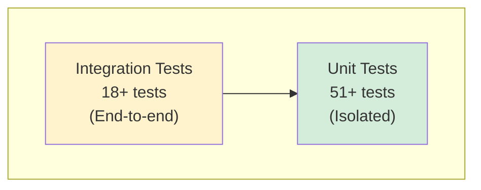

### 11.2 Test Infrastructure

- Deterministic fixtures (vulnerable code samples)
- Isolated test environments
- Mocked external services (no real network calls in tests)
- Snapshot testing for vulnerability outputs

---

## 12. Extensibility & Contribution

- New checks are added as small, testable modules and registered with the agent runner.
- Modules must include unit tests and example inputs for deterministic behavior.
- No backward compatibility guarantees for agent/rule modules; prioritize correctness and clarity.
- Update tests and documentation (`README.md`, `agents.md`, `tasks.md`) with any breaking changes.
- CI gates (typecheck, lint, tests) enforce contract compliance.

---

## 13. Next Steps

- **[View Scanning Agents](agents.md):** Detailed agent architecture
- **[API Reference](api.md):** API endpoint specifications
- **[Development Guide](development.md):** Contributing to the architecture

---
