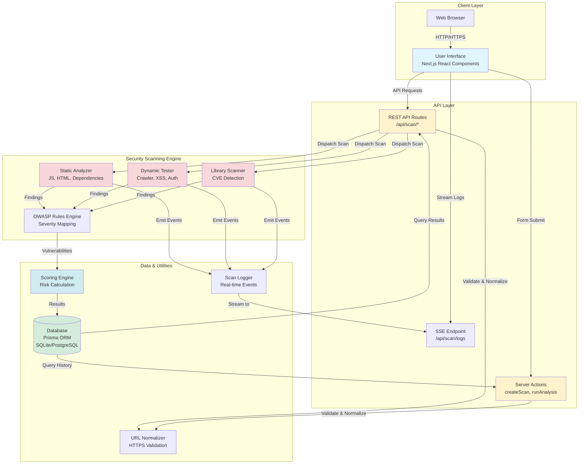
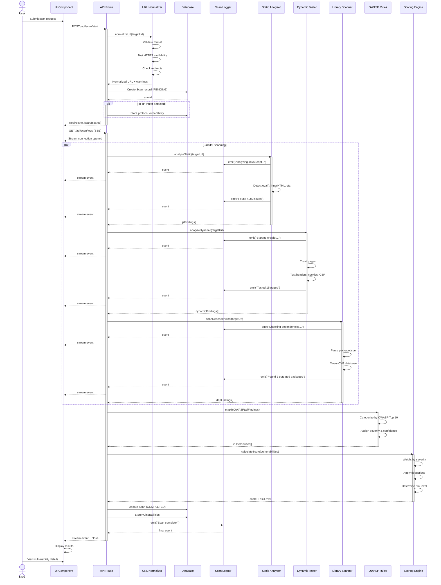
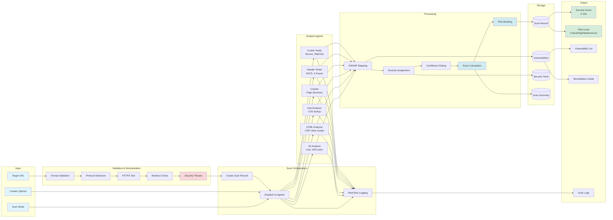

# Architecture

This document details the technical architecture, design decisions, and implementation details of WebSecScan.

---

## 🏗️ System Overview

WebSecScan follows a modern, modular architecture built on Next.js with clear separation between UI, business logic, and security scanning engines.

### High-Level Architecture Diagram



---

## 🛠️ Tech Stack

### Core Framework

| Technology | Version | Purpose |
|------------|---------|---------|
| **Next.js** | 16.1.0 | Full-stack React framework with App Router |
| **TypeScript** | 5.x | Type-safe development (strict mode) |
| **React** | 19.2.3 | UI component library |
| **Node.js** | ≥18.x | Runtime environment |

### Data Layer

| Technology | Purpose |
|------------|---------|
| **Prisma ORM** | Type-safe database access and migrations |
| **SQLite** | Default embedded database (dev/testing) |
| **PostgreSQL** | Production database option |

### Security & Testing

| Technology | Purpose |
|------------|---------|
| **Playwright** | Headless browser for dynamic testing |
| **Cheerio** | Fast HTML parsing for static analysis |
| **Node Test Runner** | Built-in test framework |

### UI/UX

| Technology | Purpose |
|------------|---------|
| **Tailwind CSS** | Utility-first CSS framework |
| **Next.js Server Components** | Server-side rendering & streaming |

---

## 📁 Project Structure

```
WebSecScan/
├── src/
│   ├── app/                    # Next.js App Router
│   │   ├── page.tsx           # Dashboard UI
│   │   ├── layout.tsx         # Root layout
│   │   ├── actions.ts         # Server Actions
│   │   ├── api/               # REST API Routes
│   │   │   ├── scan/
│   │   │   │   ├── start/route.ts
│   │   │   │   └── [id]/
│   │   │   │       ├── status/route.ts
│   │   │   │       └── results/route.ts
│   │   │   └── history/
│   │   │       └── [hostname]/route.ts  # Scan history
│   │   ├── scan/[id]/         # Scan details page
│   │   └── results/           # Results page
│   │
│   ├── components/            # React Components
│   │   ├── ScanForm.tsx           # Scan configuration form
│   │   ├── ScanSummaryCard.tsx    # Scan list card
│   │   ├── VulnerabilityCard.tsx  # Vulnerability display
│   │   ├── ScoreCard.tsx          # Security score badge
│   │   ├── SecurityTestCard.tsx   # Individual test result
│   │   ├── ScanHistory.tsx        # Historical scans table
│   │   └── ScanLogs.tsx           # Real-time log display (NEW)
│   │
│   ├── lib/                   # Shared utilities
│   │   ├── db.ts                 # Prisma client singleton
│   │   ├── scoring.ts            # Security scoring system
│   │   ├── urlNormalizer.ts      # URL validation & normalization
│   │   └── scanLogger.ts         # Real-time logging via SSE (NEW)
│   │
│   └── security/              # Security scanning engines
│       ├── static/            # Static analysis
│       │   ├── jsAnalyzer.ts
│       │   ├── htmlAnalyzer.ts
│       │   └── dependencyAnalyzer.ts
│       ├── dynamic/           # Dynamic testing
│       │   ├── crawler.ts
│       │   ├── xssTester.ts
│       │   ├── authChecks.ts
│       │   ├── headerAnalyzer.ts    # HTTP security headers
│       │   ├── cookieAnalyzer.ts    # Cookie security
│       │   └── cspAnalyzer.ts       # CSP analysis
│       └── rules/
│           └── owaspRules.ts  # OWASP mapping & rules
│
├── prisma/
│   ├── schema.prisma          # Database schema
│   ├── migrations/            # Database migrations
│   │   └── 20251220100133_add_scoring_and_tests/
│   │       └── migration.sql
│   └── seed.ts               # Test data seeder
│
├── __tests__/                 # Test suites
│   ├── jsAnalyzer.test.ts
│   ├── htmlAnalyzer.test.ts
│   ├── dependencyAnalyzer.test.ts
│   ├── urlNormalizer.test.ts      # URL normalization tests (NEW)
│   └── integration.test.ts
│
├── test-fixtures/             # Vulnerable test files
│   ├── vulnerable-script.js
│   ├── vulnerable-app.html
│   └── insecure-package.json
│
├── docs/                      # Documentation (MkDocs)
├── .github/                   # CI/CD & GitHub config
│   ├── copilot-instructions.md
│   └── workflows/
│       └── docs.yml          # GitHub Pages deployment
│
├── docker-compose.yml         # Docker orchestration
├── Dockerfile                 # Container image
├── package.json              # Node dependencies
└── tsconfig.json             # TypeScript config
```

---

## 🔄 Data Flow

### Agent Workflow Sequence Diagram



### Scan Execution Flow

```
1. User submits scan request (UI)
        ↓
2. POST /api/scan/start receives request
        ↓
3. URL Normalization & Validation
   • Validate URL format
   • Add protocol if missing (defaults to HTTPS)
   • Test HTTPS availability
   • Detect redirects (including www-redirects)
   • Flag HTTP as security threat if HTTPS unavailable
        ↓
4. Create Scan record in database (status: PENDING)
   • Record normalized URL
   • Store HTTP threat as vulnerability if detected
        ↓
5. User redirected to /scan/{scanId} page
   • SSE connection established via GET /api/scan/logs (NEW)
   • Real-time logs stream to UI
        ↓
6. Dispatch scan to appropriate agent(s)
        ↓
   ┌────┴────┬────────────┬─────────────┐
   ↓         ↓            ↓             ↓
Static    Dynamic    Dependency      Rules
Analyzer  Tester     Scanner        Validator
   │         │            │             │
   │ (emits real-time logs via ScanLogger)
   ↓         ↓            ↓             ↓
   └────┬────┴────────────┴─────────────┘
        ↓
7. Collect vulnerabilities from all agents
        ↓
8. Apply OWASP mapping & severity scoring
        ↓
9. Store results in database (status: COMPLETED)
        ↓
10. SSE connection closes, full results displayed
        ↓
11. User views detailed results & security score
```

### Request/Response Cycle

### Data Flow Diagram



**Flow Explanation**:

1. **Input Stage**: User provides target URL, selects scan mode (STATIC/DYNAMIC/BOTH), and optionally configures crawler settings
2. **Validation**: URL is validated, normalized, tested for HTTPS, and checked for security threats
3. **Orchestration**: Scan record created, agents dispatched based on mode, real-time logging initialized
4. **Analysis**: Parallel execution of specialized agents emitting findings and progress events
5. **Processing**: Findings mapped to OWASP categories, assigned severity/confidence, scored with risk banding
6. **Storage**: Results persisted to database with structured relationships
7. **Output**: Comprehensive security report with score, risk level, vulnerabilities, and remediation guidance

### Request/Response Cycle

**1. Start Scan**
```typescript
// Client → Server
POST /api/scan/start
{
  "targetUrl": "example.com",  // Protocol optional
  "scanMode": "BOTH"
}

// Server → Client (with URL normalization info)
{
  "scanId": "clx1a2b3c4d5e6f7g8h9",
  "status": "RUNNING",
  "targetUrl": "https://example.com",  // Normalized
  "mode": "BOTH",
  "urlInfo": {
    "protocol": "https",
    "redirected": false,
    "redirectedTo": null,
    "isWwwRedirect": false,
    "warnings": [
      "Protocol not specified, defaulting to HTTPS"
    ],
    "securityThreats": []  // Empty if HTTPS available
  }
}

// Server → Client (HTTP threat detected)
{
  "scanId": "clx...",
  "status": "RUNNING",
  "targetUrl": "http://insecure-site.com",
  "urlInfo": {
    "protocol": "http",
    "securityThreats": ["INSECURE_PROTOCOL"],
    "warnings": ["HTTPS not available, using HTTP"]
  }
}
```

**2. Poll Status**
```typescript
// Client → Server
GET /api/scan/{scanId}/status

// Server → Client
{
  "scanId": "clx1a2b3c4d5e6f7g8h9",
  "status": "IN_PROGRESS",
  "progress": 45,
  "stage": "Dynamic testing in progress"
}
```

**3. Fetch Results**
```typescript
// Client → Server
GET /api/scan/{scanId}/results

// Server → Client
{
  "scanId": "clx1a2b3c4d5e6f7g8h9",
  "status": "COMPLETED",
  "summary": {
    "total": 12,
    "critical": 2,
    "high": 5,
    "medium": 3,
    "low": 2
  },
  "vulnerabilities": [...]
}
```

---

## 🔍 Security Engine Design

### Static Analysis Engine

**Architecture**:
```
┌──────────────────────────────────────┐
│      Static Analysis Coordinator     │
└───────────┬──────────────────────────┘
            │
   ┌────────┴────────┬─────────────────┐
   ↓                 ↓                  ↓
┌────────┐      ┌────────┐       ┌──────────┐
│   JS   │      │  HTML  │       │Dependency│
│Analyzer│      │Analyzer│       │ Scanner  │
└────────┘      └────────┘       └──────────┘
     │               │                  │
     ↓               ↓                  ↓
┌──────────────────────────────────────────┐
│        OWASP Rules Engine                │
│  (Severity mapping & categorization)     │
└──────────────────────────────────────────┘
```

**Implementation Details**:

1. **jsAnalyzer.ts**
   ```typescript
   export async function analyzeJavaScript(
     code: string,
     filename: string
   ): Promise<AnalysisResult> {
     const vulnerabilities: Vulnerability[] = [];
     
     // Remove comments to avoid false positives
     const cleanCode = removeComments(code);
     
     // Pattern matching for dangerous APIs
     for (const rule of jsRules) {
       const matches = findMatches(cleanCode, rule.pattern);
       for (const match of matches) {
         vulnerabilities.push({
           id: generateId('JS'),
           type: rule.type,
           severity: rule.severity,
           confidence: rule.confidence,
           evidence: extractEvidence(code, match),
           location: { file: filename, line: match.line },
           remediation: rule.remediation
         });
       }
     }
     
     return { vulnerabilities };
   }
   ```

2. **htmlAnalyzer.ts**
   ```typescript
   export async function analyzeHTML(
     html: string,
     filename: string
   ): Promise<AnalysisResult> {
     const $ = cheerio.load(html);
     const vulnerabilities: Vulnerability[] = [];
     
     // Check for CSP
     if (!hasCSP($)) {
       vulnerabilities.push(createMissingCSPVuln(filename));
     }
     
     // Check inline scripts
     $('script').each((i, elem) => {
       if (!$(elem).attr('src') && !$(elem).attr('nonce')) {
         vulnerabilities.push(createInlineScriptVuln(filename, i));
       }
     });
     
     // Check forms
     $('form').each((i, elem) => {
       checkFormSecurity($, elem, vulnerabilities, filename, i);
     });
     
     return { vulnerabilities };
   }
   ```

### Dynamic Testing Engine

**Architecture**:
```
┌──────────────────────────────────────┐
│    Dynamic Testing Coordinator       │
└───────────┬──────────────────────────┘
            │
   ┌────────┴────────┬─────────────────┐
   ↓                 ↓                  ↓
┌────────┐      ┌────────┐       ┌──────────┐
│Crawler │      │  XSS   │       │  Auth    │
│        │      │ Tester │       │ Checker  │
└────────┘      └────────┘       └──────────┘
     │               │                  │
     ↓               ↓                  ↓
┌──────────────────────────────────────────┐
│         Playwright Browser               │
└──────────────────────────────────────────┘
```

**Implementation Details**:

1. **crawler.ts**
   ```typescript
   export async function crawl(
     startUrl: string,
     options: CrawlOptions
   ): Promise<CrawlResult> {
     const browser = await playwright.chromium.launch({ headless: true });
     const visited = new Set<string>();
     const queue = [startUrl];
     const endpoints: Endpoint[] = [];
     
     while (queue.length > 0 && visited.size < options.maxPages) {
       const url = queue.shift()!;
       if (visited.has(url)) continue;
       
       // Rate limiting
       await sleep(1000 / options.rateLimit);
       
       const page = await browser.newPage();
       try {
         await page.goto(url, { timeout: options.timeout });
         
         // Discover links
         const links = await page.$$eval('a', as => 
           as.map(a => a.href).filter(href => 
             href.startsWith(startUrl)
           )
         );
         queue.push(...links);
         
         // Discover forms
         const forms = await discoverForms(page);
         endpoints.push(...forms);
         
         visited.add(url);
       } finally {
         await page.close();
       }
     }
     
     await browser.close();
     return { endpoints, visited: Array.from(visited) };
   }
   ```

2. **xssTester.ts**
   ```typescript
   export async function testXSS(
     endpoint: Endpoint,
     options: TestOptions
   ): Promise<XSSResult[]> {
     const browser = await playwright.chromium.launch();
     const page = await browser.newPage();
     const results: XSSResult[] = [];
     
     for (const payload of XSS_PAYLOADS) {
       try {
         // Submit test payload
         await submitPayload(page, endpoint, payload);
         
         // Check if reflected
         const html = await page.content();
         if (isReflected(html, payload)) {
           results.push({
             type: 'Reflected XSS',
             severity: 'CRITICAL',
             endpoint: endpoint.url,
             parameter: endpoint.param,
             payload: payload,
             evidence: extractEvidence(html, payload)
           });
         }
       } catch (error) {
         // Safe failure - log but continue
         console.error('Test failed:', error);
       }
     }
     
     await browser.close();
     return results;
   }
   ```

### URL Normalization Module (NEW in v1.1)

**Location**: `src/lib/urlNormalizer.ts`

**Purpose**: Validates, normalizes, and secures target URLs before scanning begins.

**Key Functions**:

1. **`normalizeUrl(inputUrl, options)`**
   - Adds protocol if missing (defaults to HTTPS)
   - Tests HTTPS availability
   - Falls back to HTTP with security threat flagging
   - Detects redirects and www-redirects
   - Returns comprehensive URL information

2. **`validateUrlFormat(url)`**
   - Synchronous format validation
   - Checks for embedded credentials
   - Validates hostname presence
   - Returns validation result

3. **`testUrlConnection(url, timeout)`** (internal)
   - Non-destructive HEAD request
   - Connection testing with timeout
   - Returns accessibility status

4. **`checkRedirects(url, timeout)`** (internal)
   - Follows redirects
   - Detects www ↔ non-www redirects
   - Returns final destination URL

**Security Features**:
- Automatic HTTPS upgrade when available
- HTTP usage flagged as HIGH severity threat
- Maps to OWASP A04:2025 - Cryptographic Failures
- Non-destructive testing (HEAD requests only)
- Configurable timeouts prevent hanging

**Integration**:
```typescript
// In /api/scan/start/route.ts
const normalizeResult = await normalizeUrl(targetUrl, {
  preferHttps: true,
  checkRedirects: true,
  timeout: 10000,
});

// If HTTP threat detected
if (normalizeResult.securityThreats.length > 0) {
  await recordProtocolVulnerability(scanId, threat);
}
```

---

## 🗄️ Database Schema

```prisma
// prisma/schema.prisma

model Scan {
  id           String          @id @default(cuid())
  targetUrl    String
  hostname     String
  mode         ScanMode
  status       ScanStatus      @default(PENDING)
  score        Int?            // Security score (0-100)
  grade        String?         // Grade: A+, A, B, C, D, F
  createdAt    DateTime        @default(now())
  completedAt  DateTime?
  scanSummary  Json?           // Raw headers, cookies, CSP
  
  results      Vulnerability[]
  securityTests SecurityTest[]
  
  @@index([status])
  @@index([hostname])
  @@index([grade])
}

model Vulnerability {
  id            String     @id @default(cuid())
  scanId        String
  type          String
  severity      Severity
  confidence    Confidence
  description   String
  location      String
  remediation   String
  owaspCategory String?
  owaspId       String?
  ruleId        String?
  scan          Scan       @relation(fields: [scanId], references: [id])
  
  @@index([scanId])
  @@index([severity])
}

model SecurityTest {
  id             String      @id @default(cuid())
  scanId         String
  testName       String      // e.g., "Content Security Policy"
  passed         Boolean
  score          Int         // Score contribution
  result         String      // "Passed", "Failed", "Info", "N/A"
  reason         String?
  recommendation String?
  details        Json?       // Structured test data
  scan           Scan        @relation(fields: [scanId], references: [id])
  
  @@index([scanId])
}

enum ScanMode {
  STATIC
  DYNAMIC
  BOTH
}

enum ScanStatus {
  PENDING
  RUNNING
  COMPLETED
  FAILED
}

enum Severity {
  CRITICAL
  HIGH
  MEDIUM
  LOW
}

enum Confidence {
  HIGH
  MEDIUM
  LOW
}
```

---

## 🔐 Security Considerations

### Server-Side Execution Only

**Critical Constraint**: All scanning logic executes server-side to prevent:

- Client-side tampering
- Exposure of scanning techniques
- Browser security restrictions
- Unauthorized scanning attempts

```typescript
// ✅ Correct: Server Action
'use server';
export async function scanWebsite(targetUrl: string) {
  // Secure server-side execution
}

// ❌ Wrong: Client-side scanning
'use client';
export function scanWebsite(targetUrl: string) {
  // NEVER implement scanning client-side
}
```

### Input Validation

All user inputs are validated and sanitized:

```typescript
function validateScanInput(input: ScanInput): ValidationResult {
  // URL validation
  if (!isValidUrl(input.targetUrl)) {
    return { valid: false, error: 'Invalid URL' };
  }
  
  // Prevent scanning internal/private IPs
  if (isPrivateIP(input.targetUrl)) {
    return { valid: false, error: 'Cannot scan private IPs' };
  }
  
  // Rate limiting check
  if (exceedsRateLimit(input.userId)) {
    return { valid: false, error: 'Rate limit exceeded' };
  }
  
  return { valid: true };
}
```

### Safe Dynamic Testing

Dynamic tests are designed to be non-destructive:

- Timeout enforcement (30s default)
- Request rate limiting
- robots.txt compliance
- No brute force attacks
- No credential testing
- No state modification

---

## 🚀 Performance Optimizations

### Parallel Processing

```typescript
// Run multiple analyzers concurrently
const [jsResults, htmlResults, depResults] = await Promise.all([
  analyzeJavaScript(code, filename),
  analyzeHTML(html, filename),
  analyzeDependencies(packageJson, lockfile)
]);
```

### Streaming Results

Use Next.js streaming for real-time updates:

```typescript
// Stream scan progress to client
export async function streamScanProgress(scanId: string) {
  const stream = new ReadableStream({
    async start(controller) {
      const scan = await getScan(scanId);
      // Send progress updates
      for await (const update of scanProgress(scan)) {
        controller.enqueue(JSON.stringify(update));
      }
      controller.close();
    }
  });
  return new Response(stream);
}
```

### Caching Strategy

- Dependency vulnerability data cached locally
- Scan results cached for quick retrieval
- Static analysis results memoized per file hash

---

## 📊 Scalability Considerations

### Current Architecture (Single Instance)

Suitable for:
- Academic/educational use
- Small to mid-sized teams
- Development/testing environments
- Up to ~100 scans/day

### Future Scaling Path

For production at scale:

1. **Queue-based architecture**: Use message queues (Redis, RabbitMQ)
2. **Worker processes**: Dedicated scan workers
3. **Distributed scanning**: Multiple scan nodes
4. **Database sharding**: Partition by organization/user
5. **CDN integration**: Distribute static content

---

## 🧪 Testing Architecture

### Test Pyramid

```
        ┌──────────┐
        │Integration│  18+ tests
        │   Tests   │  (End-to-end)
        ├──────────┤
        │   Unit   │   51+ tests
        │   Tests  │   (Isolated)
        └──────────┘
```

### Test Infrastructure

- **Deterministic fixtures**: Fixed vulnerable code samples
- **Isolated environments**: Each test runs independently
- **Mock external services**: No real network calls in tests
- **Snapshot testing**: Expected vulnerability outputs

---

## Next Steps

- **[View Scanning Agents](agents.md)**: Detailed agent architecture
- **[API Reference](api.md)**: API endpoint specifications
- **[Development Guide](development.md)**: Contributing to the architecture
