# Architecture Overview

This page describes the high-level system architecture, layers, and design of WebSecScan.

---

## System Layers

WebSecScan separates concerns into distinct layers:

```mermaid
graph TB
    Client["🖥️ Client Layer<br/>React UI + Browser"]
    API["⚡ API Layer<br/>REST Routes + Server Actions + SSE"]
    Scanning["🔍 Security Scanning<br/>Static + Dynamic + Library Scanners"]
    Data["💾 Data & Utilities<br/>Database + Logging + Scoring"]
    
    Client --> API
    API --> Scanning
    Scanning --> Data
    Data -.-> API
    
    style Client fill:#e1f5ff
    style API fill:#fff3cd
    style Scanning fill:#f8d7da
    style Data fill:#d4edda
```

### Client Layer

**React-based web UI** running in the browser:

- Scan configuration form
- Real-time progress display (via SSE)
- Results visualization and reporting
- Scan history and management

### API Layer

**Next.js Route Handlers and Server Actions**:

- `POST /api/scan/start` — Initiate new scan
- `GET /api/scan/{id}` — Fetch scan status and results
- `GET /api/scan/{id}/logs` — Stream live logs via SSE
- Server Actions for database queries

### Scanning Layer

**Security scanning engines** (isolated, composable modules):

- **Static Analyzer** — Code pattern matching
- **Dynamic Tester** — Runtime HTTP-based testing
- **Library Scanner** — Dependency vulnerability detection

Each agent:
- Executes independently
- Produces structured findings
- Enforces safety constraints
- Logs detailed debug info

### Data Layer

**Persistence and utilities**:

- **Prisma ORM** — Database abstraction
- **Logging** — Real-time and persistent logs
- **Scoring** — Vulnerability severity calculation
- **Utilities** — URL normalization, OWASP rules

---

## Request Flow

When you initiate a scan:

### Step-by-Step

1. **User submits scan request** with target URL and mode
2. **API validates URL** (format, protocol, redirects)
3. **URL is normalized** (HTTPS upgrade attempt, etc.)
4. **Scan job is enqueued** (if async) or executed directly
5. **Static analyzer runs** (if mode = STATIC or BOTH)
6. **Dynamic tester runs** (if mode = DYNAMIC or BOTH)
7. **Findings are classified** using OWASP 2025 rules
8. **Security score is calculated** from findings
9. **Results are stored** in database
10. **Real-time logs stream** to client via SSE
11. **Final results are displayed** in UI

---

## Technology Stack

### Core Framework

| Technology | Version | Purpose |
|-----------|---------|---------|
| **Next.js** | 16.1.0 | Full-stack React framework with App Router |
| **TypeScript** | 5.x | Strict type-safe development |
| **React** | 19.2.3 | UI component library |
| **Node.js** | ≥18.x | Runtime environment |

### Database

| Technology | Purpose |
|-----------|---------|
| **Prisma ORM** | Type-safe database queries and migrations |
| **SQLite** | Embedded database for dev/testing |
| **PostgreSQL** | Production database (optional) |

### Security Testing

| Technology | Purpose |
|-----------|---------|
| **Playwright** | Headless browser for dynamic testing |
| **Cheerio** | Fast HTML parsing for static analysis |
| **Node Test Runner** | Built-in test framework |

### UI/Styling

| Technology | Purpose |
|-----------|---------|
| **Tailwind CSS** | Utility-first CSS framework |
| **React Components** | Modular, composable UI |

---

## Key Components

### Static Analyzer

**Responsibilities**:
- Pattern matching against dangerous APIs
- HTML/template security checks
- Dependency version scanning

**Input**: Source code files (JavaScript, TypeScript, HTML)  
**Output**: Structured vulnerability objects  
**Speed**: Very fast (no network calls)

### Dynamic Tester

**Responsibilities**:
- URL crawling and endpoint discovery
- XSS, SQLi, CSRF, authentication testing
- Security header analysis

**Input**: Target URL  
**Output**: Structured vulnerability objects  
**Speed**: Moderate-slow (network-based)  
**Safety**: Non-destructive, rate-limited

### Library Scanner

**Responsibilities**:
- Parse `package.json`, `requirements.txt`, etc.
- Check against vulnerability databases (NVD, CVE)
- Identify outdated packages

**Input**: Manifest files  
**Output**: Vulnerability objects  
**Speed**: Fast (local database lookups)

See [Components & Agents](components.md) for detailed agent specifications.

---

## Database Schema

WebSecScan uses a simple, auditable schema:

**Core Models**:
- `Scan` — A single security scan (ID, URL, mode, score, status)
- `Vulnerability` — A finding (type, OWASP category, severity, evidence)
- `SecurityTest` — A specific test performed (header check, XSS payload, etc.)
- `ScanLog` — Real-time log entries during scan

All data is **deterministic and reproducible**: same input → same findings.

---

## Error Handling & Resilience

### Error Categories

| Error Type | Handling |
|-----------|----------|
| **URL Validation Error** | Return 400; suggest corrected URL |
| **Connection Timeout** | Return 408; suggest longer timeout or check connectivity |
| **Scanner Crash** | Log error, mark scan as FAILED, notify user |
| **Database Error** | Log error, return 500, alert operator |

### Timeouts & Limits

| Limit | Default | Rationale |
|-------|---------|-----------|
| **Request timeout** | 10 seconds | Prevents hanging on slow/unresponsive servers |
| **Crawl max depth** | 2 levels | Limits exponential URL explosion |
| **Crawl max pages** | 50 pages | Prevents resource exhaustion |
| **Rate limit** | 1 request/second | Respects server resources |
| **Overall scan timeout** | 5 minutes | Prevents indefinite scans |

---

## Security Constraints

All security operations are **deterministic, auditable, and non-destructive**:

- ✅ No random payloads or fuzzing
- ✅ No brute force or credential guessing
- ✅ No data extraction or modification
- ✅ No exploit chaining
- ✅ Explicit authorization checks
- ✅ All logic is rule-based and reviewable

See [Security & Ethics](../security/ethics-and-authorization.md) for details.

---

## Extensibility

To add new detection rules:

1. Create a new rule module in `src/security/rules/`
2. Implement detection logic (deterministic pattern matching)
3. Map to OWASP 2025 category
4. Add unit tests
5. Update documentation

See [Contributing Guide](../development/contributing.md) for details.

---

## Next Steps

- **[Agents & Components](components.md)** — Detailed agent specifications
- **[How Scanning Works](../scanning/overview.md)** — Scan modes explained
- **[API Reference](../api/overview.md)** — REST endpoints
- **[OWASP 2025](../security/owasp-2025.md)** — Vulnerability taxonomy
