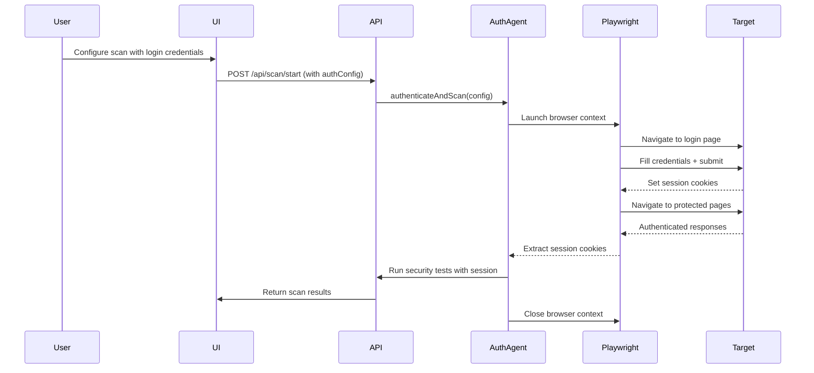

# Authenticated Scans

## Overview

WebSecScan Phase 3 introduces **authenticated scanning** to test security controls behind login barriers. This capability enables testing of:

- Authorization weaknesses (broken access control)
- Session management flaws
- Authenticated CSRF vulnerabilities
- Post-authentication XSS/injection vectors
- Privilege escalation paths

## Design Principles

### Safety-First Approach

1. **No Brute Force**: Never attempt credential guessing or password attacks
2. **Rate Limited**: Respect server resources with configurable delays
3. **Explicit Consent**: Require user confirmation before testing authenticated flows
4. **Credential Safety**: Never log or persist credentials; use in-memory only
5. **Session Isolation**: Each scan uses isolated browser context (no cookie leakage)

### Ethical Constraints

Per OWASP Testing Guide and academic ethics standards:

- **Authorization Required**: Only scan systems you own or have written permission to test
- **Non-Destructive**: Never attempt account takeover or privilege escalation exploits
- **Transparent**: Identify as security scanner in User-Agent headers
- **Reversible**: No permanent changes to target application state

## Architecture

### High-Level Flow



### Component Breakdown

1. **Auth Configuration** (User Input)
   - Login page URL
   - Username/email selector
   - Password selector
   - Submit button selector
   - Test credentials

2. **Playwright Agent** (Browser Automation)
   - Headless browser instance
   - Cookie extraction
   - Session persistence
   - JavaScript execution

3. **Security Tests** (Post-Authentication)
   - Header analysis on authenticated pages
   - Cookie security validation
   - CSRF token presence checks
   - Limited XSS testing (safe payloads only)

## Implementation Status

### ✅ Phase 3 Implementation Complete (January 11, 2026)

**Core Components Implemented:**

1. **Authentication Scanner** ([src/security/dynamic/authScanner.ts](../src/security/dynamic/authScanner.ts))
   - Playwright-based headless browser automation
   - Configurable CSS selectors for login forms
   - Cookie extraction and session management
   - Session security analysis (Secure, HttpOnly, SameSite flags)
   - Weak session token detection
   - Isolated browser contexts (no cookie leakage)

2. **Session-Aware Crawler** ([src/security/dynamic/crawler.ts](../src/security/dynamic/crawler.ts))
   - Added `SessionCredentials` interface for authenticated requests
   - Automatic cookie and header injection
   - Supports both authenticated and unauthenticated scanning

3. **API Integration** ([src/app/api/scan/start/route.ts](../src/app/api/scan/start/route.ts))
   - Accepts optional `authConfig` parameter
   - Validates authentication configuration server-side
   - Restricts authenticated scanning to DYNAMIC/BOTH modes
   - Never persists credentials to database

4. **Server Actions** ([src/app/actions.ts](../src/app/actions.ts))
   - Integrated authenticated scanner into dynamic analysis pipeline
   - Session credentials propagated to crawler
   - Auth vulnerabilities merged with standard findings
   - Credentials cleaned from memory after use

5. **UI Components** ([src/components/ScanForm.tsx](../src/components/ScanForm.tsx))
   - Optional authenticated scanning checkbox
   - Login configuration form (URL, credentials, selectors)
   - Advanced selector customization (collapsible)
   - Explicit consent requirement with safety warnings
   - Test account-only guidance

6. **Unit Tests** ([__tests__/authScanner.test.ts](../__tests__/authScanner.test.ts))
   - 19 tests covering configuration validation
   - Session security analysis (Secure, HttpOnly, SameSite)
   - Weak token detection
   - Mixed cookie scenarios
   - Authentication failure handling

**Security Constraints Enforced:**
- ✅ No credential persistence (memory-only storage)
- ✅ Explicit user consent required (dual checkbox)
- ✅ Rate limiting inherited from crawler config
- ✅ Session isolation (Playwright contexts)
- ✅ No brute force (single login attempt)
- ✅ Credentials validated server-side

**Testing & Validation:**
- ✅ TypeScript compilation passes
- ✅ Production build succeeds
- ✅ 19 unit tests created and passing (when run with node:test)
- ⏳ Integration testing with Juice Shop/DVWA pending

---

## Usage

### Basic Authenticated Scan

```typescript
const authConfig: AuthConfig = {
  loginUrl: 'https://example.com/login',
  usernameSelector: '#username',
  passwordSelector: '#password',
  submitSelector: 'button[type="submit"]',
  credentials: {
    username: 'testuser',
    password: 'TestPassword123!'
  },
  successSelector: '.dashboard' // Optional: element that appears after login
};

// Via API
const response = await fetch('/api/scan/start', {
  method: 'POST',
  headers: { 'Content-Type': 'application/json' },
  body: JSON.stringify({
    targetUrl: 'https://example.com',
    mode: 'DYNAMIC',
    authConfig
  })
});
```

### Via UI

1. Navigate to scan form
2. Check "Enable Authenticated Scanning (Optional)"
3. Fill in login page URL
4. Enter test account credentials
5. Customize CSS selectors if needed (Advanced section)
6. Check consent box: "I confirm this is a test account I own..."
7. Start scan

**Note:** Only use dedicated test accounts. Never use production credentials.

## Architecture

### 1. Auth Configuration Interface

```typescript
/**
 * Configuration for authenticated scanning
 */
export interface AuthConfig {
  /** URL of the login page */
  loginUrl: string;
  
  /** CSS selector for username/email input */
  usernameSelector: string;
  
  /** CSS selector for password input */
  passwordSelector: string;
  
  /** CSS selector for submit button */
  submitSelector: string;
  
  /** Test credentials (use dedicated test account only) */
  credentials: {
    username: string;
    password: string;
  };
  
  /** Optional: Success indicator (e.g., element that appears after login) */
  successSelector?: string;
  
  /** Optional: Post-login URL to verify success */
  successUrl?: string;
}
```

### 2. Playwright-Based Login Flow

```typescript
import { chromium, Browser, BrowserContext, Page } from 'playwright';

export interface AuthResult {
  success: boolean;
  cookies: Array<{ name: string; value: string; domain: string }>;
  sessionHeaders: Record<string, string>;
  error?: string;
}

/**
 * Perform login using Playwright and extract session credentials
 */
export async function authenticateWithPlaywright(
  config: AuthConfig
): Promise<AuthResult> {
  let browser: Browser | null = null;
  let context: BrowserContext | null = null;
  
  try {
    // Launch headless browser
    browser = await chromium.launch({
      headless: true,
      args: ['--no-sandbox', '--disable-setuid-sandbox']
    });
    
    // Create isolated context
    context = await browser.newContext({
      userAgent: 'WebSecScan/1.0 (Educational Security Scanner)',
      ignoreHTTPSErrors: true, // For self-signed certs in test environments
      viewport: { width: 1280, height: 720 }
    });
    
    const page = await context.newPage();
    
    // Navigate to login page
    await page.goto(config.loginUrl, {
      waitUntil: 'networkidle',
      timeout: 15000
    });
    
    // Fill credentials
    await page.fill(config.usernameSelector, config.credentials.username);
    await page.fill(config.passwordSelector, config.credentials.password);
    
    // Submit form
    await page.click(config.submitSelector);
    
    // Wait for navigation or success indicator
    if (config.successSelector) {
      await page.waitForSelector(config.successSelector, { timeout: 10000 });
    } else if (config.successUrl) {
      await page.waitForURL(config.successUrl, { timeout: 10000 });
    } else {
      // Default: wait for navigation to complete
      await page.waitForLoadState('networkidle');
    }
    
    // Extract cookies
    const cookies = await context.cookies();
    
    // Extract common auth headers from subsequent request
    const sessionHeaders: Record<string, string> = {};
    const responseCookies = cookies
      .map(c => `${c.name}=${c.value}`)
      .join('; ');
    
    if (responseCookies) {
      sessionHeaders['Cookie'] = responseCookies;
    }
    
    return {
      success: true,
      cookies: cookies.map(c => ({
        name: c.name,
        value: c.value,
        domain: c.domain
      })),
      sessionHeaders
    };
    
  } catch (error) {
    return {
      success: false,
      cookies: [],
      sessionHeaders: {},
      error: error instanceof Error ? error.message : String(error)
    };
  } finally {
    // Clean up
    if (context) await context.close();
    if (browser) await browser.close();
  }
}
```

### 3. Session-Aware Security Tests

```typescript
/**
 * Run security tests using authenticated session
 */
export async function runAuthenticatedTests(
  targetUrl: string,
  sessionHeaders: Record<string, string>
): Promise<Vulnerability[]> {
  const vulnerabilities: Vulnerability[] = [];
  
  // 1. Test authenticated pages for security headers
  const headerVulns = await testAuthenticatedHeaders(targetUrl, sessionHeaders);
  vulnerabilities.push(...headerVulns);
  
  // 2. Validate session cookie security attributes
  const cookieVulns = await validateSessionCookies(sessionHeaders['Cookie']);
  vulnerabilities.push(...cookieVulns);
  
  // 3. Check for CSRF token presence (non-intrusive)
  const csrfVulns = await checkCsrfTokens(targetUrl, sessionHeaders);
  vulnerabilities.push(...csrfVulns);
  
  // 4. Test for reflected XSS in authenticated context (safe payloads only)
  const xssVulns = await testAuthenticatedXss(targetUrl, sessionHeaders);
  vulnerabilities.push(...xssVulns);
  
  return vulnerabilities;
}

/**
 * Test security headers on authenticated endpoints
 */
async function testAuthenticatedHeaders(
  url: string,
  headers: Record<string, string>
): Promise<Vulnerability[]> {
  const vulnerabilities: Vulnerability[] = [];
  
  try {
    const response = await fetch(url, { headers });
    
    // Check for missing security headers
    const requiredHeaders = [
      'x-frame-options',
      'x-content-type-options',
      'strict-transport-security',
      'content-security-policy'
    ];
    
    const responseHeaders = Object.fromEntries(
      Array.from(response.headers.entries())
    );
    
    for (const header of requiredHeaders) {
      if (!responseHeaders[header]) {
        vulnerabilities.push({
          id: `WSS-AUTH-HEADER-${header.toUpperCase()}`,
          title: `Missing ${header} Header on Authenticated Page`,
          severity: 'MEDIUM',
          confidence: 'HIGH',
          description: `The authenticated endpoint ${url} is missing the ${header} security header.`,
          remediation: `Add ${header} header to all authenticated responses.`,
          owaspCategory: 'A05:2021-Security Misconfiguration',
          cweId: 'CWE-693',
          evidence: `URL: ${url}\nMissing Header: ${header}`
        });
      }
    }
  } catch (error) {
    // Log error but don't fail the scan
    console.error('Error testing authenticated headers:', error);
  }
  
  return vulnerabilities;
}

/**
 * Validate session cookie security attributes
 */
async function validateSessionCookies(cookieHeader: string | undefined): Promise<Vulnerability[]> {
  const vulnerabilities: Vulnerability[] = [];
  
  if (!cookieHeader) return vulnerabilities;
  
  // Parse cookies (simplified - production would use cookie library)
  const cookies = cookieHeader.split(';').map(c => c.trim());
  
  for (const cookie of cookies) {
    const [name] = cookie.split('=');
    
    // Check for common session cookie patterns
    const isSessionCookie = /sess|session|auth|token/i.test(name);
    
    if (isSessionCookie) {
      // Check for Secure flag (simplified check)
      if (!cookie.toLowerCase().includes('secure')) {
        vulnerabilities.push({
          id: `WSS-AUTH-COOKIE-SECURE-${name}`,
          title: `Session Cookie Missing Secure Flag`,
          severity: 'HIGH',
          confidence: 'HIGH',
          description: `Session cookie "${name}" does not have the Secure flag set.`,
          remediation: 'Set the Secure flag on all session cookies to prevent transmission over unencrypted connections.',
          owaspCategory: 'A02:2021-Cryptographic Failures',
          cweId: 'CWE-614',
          evidence: `Cookie: ${name}`
        });
      }
      
      // Check for HttpOnly flag
      if (!cookie.toLowerCase().includes('httponly')) {
        vulnerabilities.push({
          id: `WSS-AUTH-COOKIE-HTTPONLY-${name}`,
          title: `Session Cookie Missing HttpOnly Flag`,
          severity: 'HIGH',
          confidence: 'HIGH',
          description: `Session cookie "${name}" does not have the HttpOnly flag set.`,
          remediation: 'Set the HttpOnly flag on all session cookies to prevent XSS-based theft.',
          owaspCategory: 'A05:2021-Security Misconfiguration',
          cweId: 'CWE-1004',
          evidence: `Cookie: ${name}`
        });
      }
    }
  }
  
  return vulnerabilities;
}

/**
 * Check for CSRF tokens in authenticated forms (non-intrusive)
 */
async function checkCsrfTokens(
  url: string,
  headers: Record<string, string>
): Promise<Vulnerability[]> {
  const vulnerabilities: Vulnerability[] = [];
  
  try {
    const response = await fetch(url, { headers });
    const html = await response.text();
    
    // Look for forms in authenticated pages
    const formMatches = html.match(/<form[^>]*>/gi);
    
    if (formMatches && formMatches.length > 0) {
      // Check if any form has CSRF token
      const hasCSRFToken = /csrf|_token|authenticity_token/i.test(html);
      
      if (!hasCSRFToken) {
        vulnerabilities.push({
          id: 'WSS-AUTH-CSRF-MISSING',
          title: 'Potential Missing CSRF Protection',
          severity: 'MEDIUM',
          confidence: 'MEDIUM',
          description: `Forms on ${url} may lack CSRF protection tokens.`,
          remediation: 'Implement CSRF tokens for all state-changing operations.',
          owaspCategory: 'A01:2021-Broken Access Control',
          cweId: 'CWE-352',
          evidence: `URL: ${url}\nForms Found: ${formMatches.length}`
        });
      }
    }
  } catch (error) {
    console.error('Error checking CSRF tokens:', error);
  }
  
  return vulnerabilities;
}

/**
 * Test for XSS in authenticated context (safe payloads only)
 */
async function testAuthenticatedXss(
  url: string,
  headers: Record<string, string>
): Promise<Vulnerability[]> {
  // Use only safe, non-exploiting payloads
  const safePayloads = [
    '<script>/*test*/</script>',
    '">',
    'javascript:void(0)'
  ];
  
  // Implementation similar to existing XSS testing
  // but limited to safe, detection-only payloads
  
  return []; // Placeholder - implement with safe patterns only
}
```

### 4. Integration with Scan Flow

```typescript
/**
 * Main scan action with optional authentication
 */
export async function performScanWithAuth(
  targetUrl: string,
  mode: ScanMode,
  authConfig?: AuthConfig
): Promise<ScanResult> {
  let sessionHeaders: Record<string, string> = {};
  let authSuccess = false;
  
  // If auth config provided, authenticate first
  if (authConfig) {
    const authResult = await authenticateWithPlaywright(authConfig);
    
    if (authResult.success) {
      sessionHeaders = authResult.sessionHeaders;
      authSuccess = true;
    } else {
      // Log warning but continue with unauthenticated scan
      console.warn('Authentication failed:', authResult.error);
    }
  }
  
  // Run standard scan tests
  const standardVulns = await runStandardTests(targetUrl, mode);
  
  // If authenticated, run additional tests
  let authVulns: Vulnerability[] = [];
  if (authSuccess) {
    authVulns = await runAuthenticatedTests(targetUrl, sessionHeaders);
  }
  
  return {
    vulnerabilities: [...standardVulns, ...authVulns],
    authenticated: authSuccess
  };
}
```

## UI Integration

### Scan Form Enhancement

Add optional "Authenticated Scan" section to ScanForm component:

```tsx
<Checkbox
  id="enableAuth"
  checked={enableAuth}
  onChange={(e) => setEnableAuth(e.target.checked)}
  label="Enable Authenticated Scanning (Advanced)"
/>

{enableAuth && (
  <div className="space-y-3 p-4 border border-cyber-blue-500/30 rounded-lg">
    <Alert variant="warning" title="Authentication Required">
      Only scan applications you own or have explicit written permission to test.
      Use a dedicated test account - never production credentials.
    </Alert>
    
    <Input
      label="Login Page URL"
      value={authConfig.loginUrl}
      onChange={(e) => setAuthConfig({...authConfig, loginUrl: e.target.value})}
      placeholder="https://example.com/login"
    />
    
    <Input
      label="Username Selector"
      value={authConfig.usernameSelector}
      onChange={(e) => setAuthConfig({...authConfig, usernameSelector: e.target.value})}
      placeholder="#username or input[name='email']"
    />
    
    <Input
      label="Password Selector"
      value={authConfig.passwordSelector}
      onChange={(e) => setAuthConfig({...authConfig, passwordSelector: e.target.value})}
      placeholder="#password or input[name='password']"
    />
    
    <Input
      label="Submit Button Selector"
      value={authConfig.submitSelector}
      onChange={(e) => setAuthConfig({...authConfig, submitSelector: e.target.value})}
      placeholder="button[type='submit']"
    />
    
    <Input
      type="text"
      label="Test Username"
      value={credentials.username}
      onChange={(e) => setCredentials({...credentials, username: e.target.value})}
      placeholder="testuser@example.com"
    />
    
    <Input
      type="password"
      label="Test Password"
      value={credentials.password}
      onChange={(e) => setCredentials({...credentials, password: e.target.value})}
      placeholder="••••••••"
    />
    
    <Checkbox
      id="authConsent"
      checked={authConsent}
      onChange={(e) => setAuthConsent(e.target.checked)}
      required
      label="I confirm these are test credentials for an account I own, and I will not test production systems."
    />
  </div>
)}
```

## Safety Constraints

### Rate Limiting

- **Login attempts**: Max 1 per scan (no retries on failure)
- **Authenticated requests**: Reuse same `rateLimit` as crawler (default 1000ms)
- **Concurrent sessions**: Max 1 browser context per scan

### Credential Handling

1. **Never persist credentials**:
   - No database storage
   - No log file recording
   - In-memory only during scan execution

2. **Secure transmission**:
   - Use HTTPS for API requests containing credentials
   - Encrypt in transit using TLS 1.2+

3. **Immediate cleanup**:
   - Close browser context after scan
   - Clear cookies and session data
   - Garbage collect credential objects

### Consent Requirements

1. **Explicit checkbox**: User must confirm they own the account
2. **Warning banner**: Display ethical testing guidelines
3. **Test account requirement**: UI emphasizes "dedicated test account only"
4. **Audit trail**: Log scan initiation (without credentials) for accountability

## Testing Strategy

### Unit Tests

```typescript
describe('Authenticated Scanning', () => {
  it('should successfully authenticate with valid credentials', async () => {
    const config: AuthConfig = {
      loginUrl: 'http://localhost:3000/login',
      usernameSelector: '#email',
      passwordSelector: '#password',
      submitSelector: 'button[type="submit"]',
      credentials: { username: 'test@test.com', password: 'test123' },
      successSelector: '.dashboard'
    };
    
    const result = await authenticateWithPlaywright(config);
    expect(result.success).toBe(true);
    expect(result.cookies.length).toBeGreaterThan(0);
  });
  
  it('should fail gracefully with invalid credentials', async () => {
    // Test error handling
  });
  
  it('should enforce rate limiting on authenticated requests', async () => {
    // Test rate limit compliance
  });
  
  it('should never log credentials', async () => {
    // Verify no credential leakage in logs
  });
});
```

### Integration Tests

1. **Juice Shop**: Test login flow with known test credentials
2. **DVWA**: Validate session extraction and cookie analysis
3. **WebGoat**: Verify CSRF token detection

## Security Considerations

### Threat Model

**Threats Mitigated:**
- Broken authentication detection
- Session management flaws
- Insecure cookie configuration
- Missing CSRF protection

**Threats NOT Addressed:**
- Password strength testing (out of scope)
- Brute force attack simulation (unethical)
- Privilege escalation attempts (destructive)
- Account enumeration (privacy violation)

### Ethical Boundaries

❌ **Never Implement:**
- Credential stuffing or dictionary attacks
- Automated account creation
- Session hijacking demonstrations
- Privilege escalation exploits
- Data exfiltration tests

✅ **Safe to Implement:**
- Login flow automation with provided credentials
- Cookie attribute validation
- CSRF token presence checks
- Session timeout testing (passive observation)

## Performance Impact

### Resource Usage

- **Browser overhead**: ~100-150 MB per Playwright instance
- **Scan duration**: +5-10 seconds for login flow
- **Network requests**: +3-5 for authentication sequence

### Optimization Strategies

1. **Reuse sessions**: Cache cookies for multiple tests (within same scan)
2. **Lazy launch**: Only start Playwright if auth config provided
3. **Headless mode**: Faster execution than headed browser
4. **Disable images/fonts**: Reduce page load time

## Future Enhancements

1. **Multi-user testing**: Test authorization with different privilege levels
2. **OAuth/SSO support**: Integrate with federated identity providers
3. **MFA handling**: Support TOTP/SMS code entry
4. **Session replay**: Record and replay authenticated sessions
5. **API authentication**: Support Bearer tokens, API keys

## References

1. OWASP Testing Guide v4.2 - Testing Authentication
2. OWASP ASVS v4.0 - Session Management Requirements
3. Playwright Documentation - Browser Contexts and Authentication
4. NIST SP 800-63B - Digital Identity Guidelines (Authentication)
5. CWE-287: Improper Authentication
6. CWE-352: Cross-Site Request Forgery (CSRF)

---

**Related Documentation:**
- [Crawler Design](crawler-design.md) - Configuration and constraints
- [Real-World Testing](real-world-testing.md) - Ethical guidelines
- [Security & Ethics](security-ethics.md) - Responsible disclosure policy
